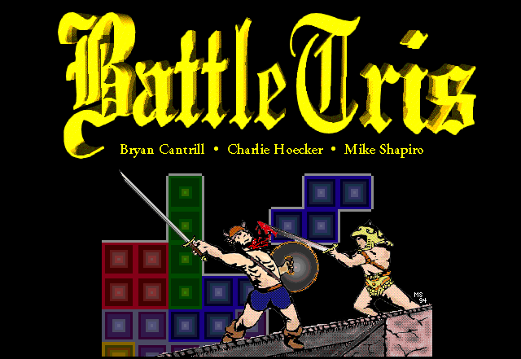

## BattleTris: Two-player networked Tetris with a twist

### History

BattleTris was written at Brown University as a CS32 final project in
spring 1994 by Bryan Cantrill, Charles Hoecker and Mike Shapiro.
It has been revived several times since (though the most recent was
a quarter century ago); this revival dates to 2026.

### Requirements

While originally written for Solaris on SPARC, this version is known to
work on both MacOS (via XQuartz and OpenMotif) and on Linux.  

To play against someone else, you will need to be able to directly 
connect to one another's IP address, and each of you will need to connect
to a host running an instance of `btserverd` (which can be found in
`usr/src/daemons`).  This keeps a player database that can be manipulated
with `btref`.

To play against the computer, run `BattleTris -X`.

##

## Description

